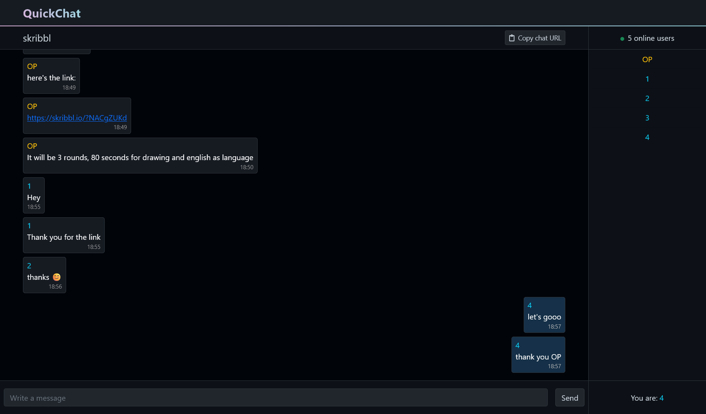

<h1 align="center">
   QuickChat
</h1>

    <strong>QuickChat is an anonymous chat website to easily discuss on any topic you want without storing any message. What happens on QuickChat stays on QuickChat 😉</strong>

    <a href="https://github.com/d-roduit/QuickChat">
        
        
        
        
    </a>

 

## Table of Contents

1. [Getting Started](#getting-started)
2. [Technologies](#technologies)
3. [Guides and resources](#guides-and-resources)

## Getting Started

### Running the website

You will need to follow the steps below in order to run the website :

1. Install the Java runtime on your computer (if not already done). JDK17 or higher is required.
2. Download the project files in ZIP format to your computer.
3. Unzip the downloaded file.
4. Open the project folder (the unzipped folder) in your prefered IDE (Eclipse, IntelliJ IDEA, etc.)
5. Run the website via the IDE (it will provide you with the website URL, something like `http://localhost:8080`)

Once the 5 steps have been done, **you are ready to chat with your friends via QuickChat!**

## Technologies

The main language used in this project is Java (JDK version 17) and uses the Spring framwork to develop the web application.

The front-end uses :
- Bootstrap
- SockJS _(for communication over websockets)_

The back-end uses :
- Thymeleaf _(Java template engine)_
- PostgreSQL

Moreover, the software project management used is Maven.

You can find all the links to the technologies used in the [Guides and resources](#guides-and-resources) section

## Guides and resources
* [Spring](https://spring.io/) - Development framework
* [Apache Tomcat](http://tomcat.apache.org/) - Web server
* [Thymeleaf](https://www.thymeleaf.org/) - Server-side Java template engine
* [Bootstrap](https://getbootstrap.com/) - Front-End toolkit
* [SockJS](https://github.com/sockjs/sockjs-client) - WebSocket client library
* [JUnit](https://junit.org/) - Java testing framework
* [PostgreSQL](https://www.postgresql.org/) - Database
* [Maven](https://maven.apache.org/) - Software project management tool

## License

This project is licensed under the MIT License
